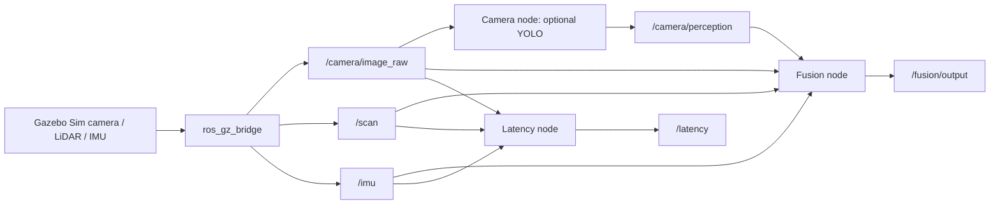

# Multi-Sensor Perception for Autonomous Robots

A **simulation-based academic prototype** that combines camera, LiDAR, and IMU messages in ROS 2 Jazzy and Gazebo Sim. The code demonstrates sensor-topic integration, approximate time synchronization, a simple fused summary, optional YOLO camera detection, and timing diagnostics. It is not a calibrated autonomous navigation stack.

## What to inspect

| Component | Implementation |
| --- | --- |
| Gazebo world, robot model, bridge, launcher | [`ros2_ws/src/multi_sensor_perception`](ros2_ws/src/multi_sensor_perception/) |
| Camera, LiDAR, IMU, fusion, and latency nodes | [`multi_sensor_perception/`](ros2_ws/src/multi_sensor_perception/multi_sensor_perception/) |
| Pure fusion calculations and functional tests | [`perception_math.py`](ros2_ws/src/multi_sensor_perception/multi_sensor_perception/perception_math.py), [`test_perception_math.py`](ros2_ws/src/multi_sensor_perception/test/test_perception_math.py) |

The authoritative package is **only** under `ros2_ws/src/`. An earlier package copy was removed after comparing both directories; it remains recoverable in Git history. The `PROJECT_STEPS.md` file records the original plan and is not a current progress report.

## Architecture



The fusion node synchronizes raw image, scan, and IMU messages with a 150 ms tolerance. It takes the closest finite LiDAR reading within 7 m, converts the IMU quaternion to yaw, and includes camera telemetry when it is within 300 ms of the image timestamp. The camera node can use YOLO when compatible weights and dependencies are installed. Otherwise `image_present` means only that a frame arrived.

## Build and run

Use Ubuntu 24.04 with ROS 2 Jazzy, Gazebo integration (`ros_gz`), `colcon`, and the dependencies declared in [`package.xml`](ros2_ws/src/multi_sensor_perception/package.xml). These commands require a working ROS environment; the current Windows audit could not run the full Gazebo simulation.

```bash
git clone https://github.com/loutchianamarie/robotics.git
cd robotics/ros2_ws
source /opt/ros/jazzy/setup.bash
colcon build --packages-select multi_sensor_perception
source install/setup.bash
ros2 launch multi_sensor_perception simulation.launch.py
```

In separate sourced terminals from `robotics/ros2_ws`, start:

```bash
ros2 run multi_sensor_perception camera_node --ros-args -p use_sim_time:=true -p enable_ai:=false
ros2 run multi_sensor_perception fusion_node --ros-args -p use_sim_time:=true
ros2 run multi_sensor_perception latency_node --ros-args -p use_sim_time:=true
```

The launcher starts Gazebo, the bridge, and robot spawning. It does **not** start the perception nodes. For sensor-specific inspection, also run `lidar_node` and `imu_node`. With the simulation playing:

```bash
ros2 topic hz /scan
ros2 topic echo /fusion/output --once
ros2 topic echo /latency --once
```

For optional YOLO inference, install compatible `cv_bridge` and `ultralytics` packages in the ROS Python environment, make `yolov8n.pt` available, and set `enable_ai:=true`. The code falls back to simple mode if model loading fails.

## Tests and scope

The CI workflow compiles Python sources and tests pure fusion helpers without ROS. Run the same checks locally with `PYTHONPATH=ros2_ws/src/multi_sensor_perception python -m pytest -q ros2_ws/src/multi_sensor_perception/test/test_perception_math.py` after installing `pytest`. ROS build, launch, simulated sensor flow, and YOLO inference still need verification in a ROS 2 Jazzy environment. No accuracy, end-to-end latency, or field performance numbers are claimed.

The LiDAR obstacle flag is not associated with a particular camera bounding box. There is no sensor calibration, probabilistic state estimator, map, or navigation controller. The latency node reports a callback timing proxy; it does not measure the full camera inference-to-fusion path. A recorded simulation demo is still needed.

## Attribution and license

Loutchiana Marie authored the ROS implementation commits in this repository; Charbel Mezeraani contributed documentation commits. See Git history for attribution. No open-source license has been granted for the combined repository, so obtain contributor agreement before reusing or relicensing the code.
